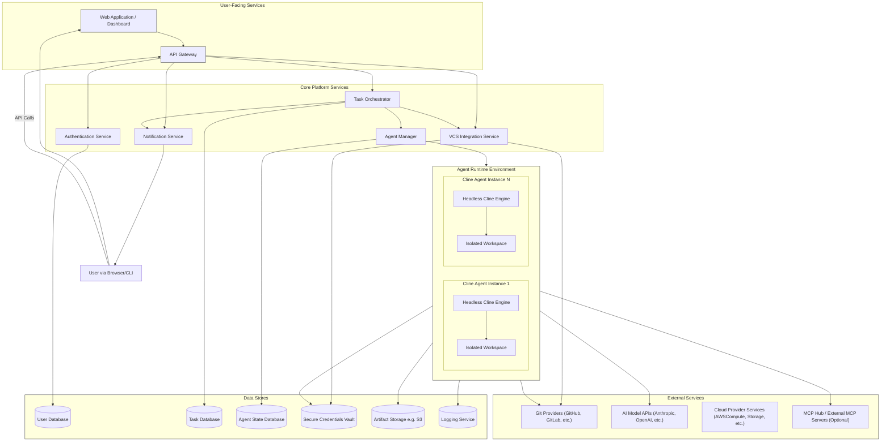

# P1: System Architecture Overview

## 1. Introduction

This document describes the high-level system architecture for the Remote Cline Agent Platform. It outlines the major components and their interactions.

## 2. Architectural Goals

*   **Scalability:** The system must be able to scale to support a large number of users, agents, and tasks.
*   **Reliability:** Ensure high availability and fault tolerance.
*   **Modularity:** Components should be loosely coupled to allow for independent development, deployment, and scaling.
*   **Security:** Security must be a fundamental consideration in the design of all components.
*   **Extensibility:** The architecture should allow for future addition of new features and capabilities.
*   **Maintainability:** Clear separation of concerns to facilitate easier maintenance and updates.

## 3. High-Level Architecture Diagram

## 4. Component Descriptions

### 4.1. User-Facing Services

*   **Web Application / Dashboard:**
    *   Provides the primary user interface for interacting with the platform.
    *   Built using a modern web framework (e.g., React, Vue, Angular).
    *   Allows users to register, log in, define tasks, monitor progress, review results, and manage settings.
*   **API Gateway:**
    *   Single entry point for all external API requests (from the Web App or third-party clients).
    *   Handles request routing, authentication, rate limiting, and request/response transformations.

### 4.2. Core Platform Services

*   **Authentication Service:**
    *   Manages user identities, authentication (e.g., OAuth, JWT), and authorization.
    *   Interacts with the User Database.
*   **Task Orchestrator:**
    *   Central component for managing the lifecycle of tasks.
    *   Receives task definitions, validates them, and queues them for execution.
    *   Coordinates with the Agent Manager to assign tasks to available Cline Agent Instances.
    *   Tracks task status, handles retries, and manages task results.
    *   Interacts with the Task Database.
*   **Agent Manager:**
    *   Responsible for provisioning, managing, and scaling Cline Agent Instances.
    *   Monitors the health and availability of agent instances.
    *   Assigns specific tasks to individual agent instances based on requests from the Task Orchestrator.
    *   Interacts with the Agent State Database and the underlying cloud provider's compute services.
*   **VCS Integration Service:**
    *   Handles all interactions with external Version Control Systems (e.g., GitHub, GitLab).
    *   Manages cloning repositories, creating branches, committing changes, and opening pull/merge requests on behalf of agents.
    *   Securely accesses credentials from the Secure Credentials Vault.
*   **Notification Service:**
    *   Sends notifications to users about task status changes, completion, errors, or required actions (e.g., review a PR).
    *   Supports various notification channels (e.g., email, in-app notifications, webhooks).

### 4.3. Agent Runtime Environment

*   **Cline Agent Instance:**
    *   An isolated environment where a single Remote Cline Agent task is executed.
    *   Likely containerized (e.g., Docker).
    *   Contains:
        *   **Headless Cline Engine:** The adapted core Cline logic capable of running without a VSCode UI. It interacts with AI models, executes tools, and manages the task's context.
        *   **Isolated Workspace:** A dedicated file system space for cloning repositories, storing temporary files, and performing operations for the assigned task.
*   **MCP Hub (Optional):**
    *   If MCP server integration is required for remote agents, each agent instance might connect to a central MCP Hub or directly to configured MCP servers.

### 4.4. Data Stores

*   **User Database:** Stores user account information, profiles, and settings.
*   **Task Database:** Stores task definitions, status, history, metadata, and links to results/artifacts.
*   **Agent State Database:** Tracks the status, configuration, and assignments of Cline Agent Instances.
*   **Secure Credentials Vault:** Securely stores sensitive information like API keys for AI models, VCS access tokens, and other secrets.
*   **Artifact Storage:** Stores large output files, logs, or other artifacts generated by agents (e.g., S3, Azure Blob Storage).
*   **Logging Service:** Centralized service for collecting, storing, and querying logs from all platform components and agent instances.

### 4.5. External Services

*   **Git Providers:** External services like GitHub, GitLab, Bitbucket where source code is hosted.
*   **AI Model APIs:** Third-party AI services (Anthropic, OpenAI, etc.) that the Headless Cline Engine interacts with.
*   **Cloud Provider Services:** Underlying IaaS/PaaS services for compute, storage, networking, databases, etc.

## 5. Key Technology Choices (To Be Determined)

*   **Programming Languages/Frameworks:** For backend services, web application, and agent adaptation.
*   **Cloud Provider:** AWS, Azure, GCP, or others.
*   **Containerization & Orchestration:** Docker, Kubernetes.
*   **Databases:** SQL (e.g., PostgreSQL, MySQL) and/or NoSQL (e.g., MongoDB, DynamoDB) based on component needs.
*   **Message Queues:** For asynchronous task processing (e.g., RabbitMQ, Kafka, SQS).
*   **API Gateway Technology:** (e.g., AWS API Gateway, Kong, Apigee).
*   **Logging/Monitoring Tools:** ELK Stack, Prometheus, Grafana, Datadog.

## 6. Data Flow Example (Simplified Task Execution)

1.  User submits a task via the Web Application.
2.  Web App sends the request to the API Gateway.
3.  API Gateway authenticates the user via AuthService and forwards the task to the Task Orchestrator.
4.  Task Orchestrator validates the task, stores it in TaskDB, and requests an agent from Agent Manager.
5.  Agent Manager provisions or assigns an available Cline Agent Instance.
6.  Task Orchestrator sends task details to the assigned Agent Instance.
7.  The Headless Cline Engine in the Agent Instance:
    *   Uses VCSManager (indirectly, or has its own VCS client logic) to clone the repo into its Workspace.
    *   Executes the task logic, interacting with AI Models and potentially Git Providers.
    *   Stores results/artifacts in Artifact Storage and logs to LogStore.
8.  Agent Instance reports completion/status back to Task Orchestrator.
9.  Task Orchestrator updates TaskDB and notifies the user via NotificationService.
10. User views results in the Web Application.

---
Return to [README](../README.md)
