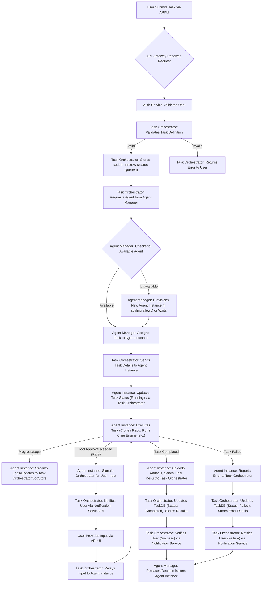

# P5: Task Orchestration and Execution

## 1. Introduction

This document describes the system responsible for orchestrating and managing the execution of tasks by Remote Cline Agents. It covers the lifecycle of a task from submission to completion.

## 2. Core Components Involved

*   **API Gateway:** Receives task creation requests.
*   **Task Orchestrator:** The central brain for managing task lifecycle.
*   **Task Database:** Stores persistent state of tasks.
*   **Agent Manager:** Manages the pool of Cline Agent Instances.
*   **Cline Agent Instance (Headless Cline Engine):** Executes the actual task.
*   **Notification Service:** Informs users about task progress.
*   **Logging Service & Artifact Storage:** Store outputs from task execution.

## 3. Task Lifecycle

## 4. Detailed Steps in Task Orchestration

### 4.1. Task Submission and Validation

1.  User submits a task through the Web Application or directly via the API Gateway.
2.  API Gateway authenticates the request and forwards it to the Task Orchestrator.
3.  Task Orchestrator validates the task definition:
    *   Checks for required fields (e.g., repository URL, instructions).
    *   Validates repository accessibility (if possible, or defers to agent).
    *   Checks user quotas or permissions.
4.  If invalid, an error is returned.
5.  If valid, the task is persisted in the Task Database with a unique `task_id` and initial status (e.g., "queued").

### 4.2. Agent Allocation and Task Assignment

1.  Task Orchestrator requests an available agent instance from the Agent Manager.
2.  Agent Manager checks its pool of active Cline Agent Instances:
    *   If a suitable, idle agent is available, it's assigned the task.
    *   If no idle agent is available, the Agent Manager may:
        *   Provision a new agent instance (if auto-scaling rules permit and capacity is available). This involves starting a new container.
        *   Place the task in a higher-level queue until an agent becomes free or is provisioned.
3.  Once an agent is assigned, the Agent Manager updates its state (e.g., "busy," `assigned_task_id`).
4.  Task Orchestrator is notified of the assigned agent.

### 4.3. Task Execution

1.  Task Orchestrator sends the full task definition (including instructions, repo details, configurations, credentials) securely to the assigned Cline Agent Instance.
2.  The Agent Instance:
    *   Acknowledges receipt and updates its status to "running" (reported back to Task Orchestrator, which updates TaskDB).
    *   Sets up its isolated workspace (e.g., clones the specified repository and branch).
    *   Initializes the Headless Cline Engine with the task parameters.
    *   The Headless Cline Engine begins processing the task:
        *   Interacts with AI models.
        *   Uses tools as needed (file operations, command execution within its sandbox).
        *   Streams logs, progress messages, and any intermediate outputs back to the Task Orchestrator (or directly to a LogStore/ArtifactStore, with metadata sent to Orchestrator).
    *   Handles internal retries or error recovery as designed in the Headless Cline Engine.

### 4.4. Handling `ask_followup_question` (If Implemented for Autonomous Mode)

*   If the agent determines it needs user input (a rare case for autonomous operation):
    1.  Agent signals the Task Orchestrator with the question and current task state.
    2.  Task Orchestrator updates task status (e.g., "pending_input") in TaskDB.
    3.  Notification Service alerts the user via the Web Application or other channels.
    4.  User provides input through the UI/API.
    5.  Task Orchestrator relays the input back to the waiting agent.
    6.  Agent resumes execution.

### 4.5. Task Completion or Failure

*   **On Successful Completion:**
    1.  Agent finalizes its work (e.g., commits changes to a new branch, prepares diffs).
    2.  Uploads any generated artifacts (reports, files) to Artifact Storage.
    3.  Sends a completion signal with final results/summary (e.g., PR URL, diff summary) to the Task Orchestrator.
    4.  Task Orchestrator updates TaskDB status to "completed," stores results.
    5.  Notification Service informs the user.
*   **On Failure:**
    1.  Agent captures error details and logs.
    2.  Sends a failure signal with error information to the Task Orchestrator.
    3.  Task Orchestrator updates TaskDB status to "failed," stores error details.
    4.  Notification Service informs the user.
*   **Task Cancellation:**
    1.  User requests cancellation via API/UI.
    2.  Task Orchestrator sends a cancellation signal to the assigned Agent Instance.
    3.  Agent Instance attempts to gracefully terminate its current operations, clean up, and report its final state.
    4.  Task Orchestrator updates TaskDB status to "cancelled."

### 4.6. Agent Release and Cleanup

1.  After a task is completed, failed, or cancelled, the Agent Manager is notified.
2.  The Agent Manager:
    *   Marks the agent instance as idle.
    *   May de-provision the agent instance if auto-scaling rules dictate (to save costs).
    *   Ensures the agent's workspace is cleaned/reset for the next task or destroyed if the instance is de-provisioned.

## 5. Task Queuing and Prioritization (Future Consideration)

*   Implement different priority queues for tasks (e.g., based on user subscription tier, task type).
*   Fairness algorithms to prevent starvation of lower-priority tasks.

## 6. Concurrency and Resource Limits

*   Define limits on concurrent tasks per user or per account.
*   Agent Manager enforces these limits when provisioning/assigning agents.

## 7. Error Handling and Retries by Orchestrator

*   The Task Orchestrator should implement retry logic for transient failures during communication with other services (e.g., Agent Manager, databases).
*   Define policies for retrying failed tasks (e.g., number of retries, backoff strategy), potentially based on error type. Some errors might be non-retryable.

---
Return to [README](../README.md)
